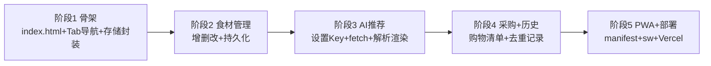

# 开发计划 Plan.md —— 冰箱食材 → 菜谱推荐

## 目标

单文件纯静态 Web 应用，按 5 个阶段迭代；每阶段结束可独立验证、可上线。最终产物可整体交给 Vercel 静态部署。

## 技术栈总览

| 项 | 选型 |
|---|---|
| 前端 | 单一 `index.html` + 原生 JS（IIFE/模块隔离）+ Tailwind CDN |
| 图标 | 内联 SVG / Emoji（避免额外资源请求） |
| 存储封装 | 统一 `store.js` 风格读写函数（内联在 index.html） |
| AI 调用 | `fetch` OpenAI 兼容接口：`POST {baseUrl}/chat/completions` |
| 部署 | Vercel 静态目录（`vercel.json` 可选） |
| PWA | `manifest.json` + `sw.js`（放在同目录静态托管） |

---

## 阶段总览



---

## 阶段 1：项目骨架

**目标**：可运行的单页应用，3 个页面可切换，存储工具就绪。

任务：
- [ ] 创建 `index.html`，引入 Tailwind CSS CDN `<script src="https://cdn.tailwindcss.com">`
- [ ] 设置中文 `<html lang="zh-CN">`、viewport（含 `viewport-fit=cover`）、深色安全区处理
- [ ] 顶部简单 Header（应用名「冰箱菜谱」）+ 底部固定 Tab 导航（冰箱/历史/我的），图标用 Emoji
- [ ] 三个 `<section>` 页面容器，JS 封装 `showPage(name)` 切换 className + Tab 高亮联动
- [ ] 编写存储封装：
  - `readJSON(key, def)` / `writeJSON(key, obj)`
  - `uuid()`（`crypto.randomUUID()` 兜底）
  - `todayStr()`（本地时区 `YYYY-MM-DD`）
  - schema `version` 迁移函数 `migrate()` 占位
- [ ] 基础深色/浅色下安全区 padding 与底部留白（避免导航遮挡）

产出：`index.html`（骨架可用，切换页面正常）。

---

## 阶段 2：食材管理

**目标**：食材可增删改，刷新不丢。

任务：
- [ ] 食材输入表单：名称 input + 数量 input + 「添加」按钮
- [ ] 校验：名称为空禁用提交；同名已存在时提示合并或覆盖
- [ ] 食材列表渲染：每行「名称 — 数量」+ 编辑 / 删除按钮
- [ ] 编辑交互：点击编辑 → 行内变为输入框，保存后写回
- [ ] 删除交互：点击删除 → 移除并持久化（可加撤销/确认）
- [ ] 空态引导：无数据时显示「先在下方添加食材」
- [ ] 所有变更写 `fridge:ingredients`，刷新回读
- [ ] 底部增加「推荐今日菜谱」按钮的入口（逻辑阶段 3 实现）

产出：食材管理与持久化完整可用。

---

## 阶段 3：AI 菜谱推荐

**目标**：根据食材 + 排除名单调用大模型，渲染推荐卡片。

任务：
- [ ] 设置页：API Key（password type + 眼睛切换）、模型下拉、baseUrl、保存/清除
- [ ] 持久化到 `fridge:settings`
- [ ] `getLastNDishNames(days)`：从 `fridge:history` 取最近 N 天（按自然日）菜名去重
- [ ] 组装 prompt（system+user，见 spec.md 第 6 节模板）
- [ ] `fetch` 调用 OpenAI 兼容接口：
  ```js
  POST {baseUrl}/chat/completions
  body: { model, messages: [{role:'system',...},{role:'user',...}], temperature: 0.7, response_format:{type:'json_object'} /* 部分模型支持，异常则忽略 */ }
  headers: Authorization: Bearer {apiKey}, Content-Type: application/json
  ```
- [ ] 解析返回：提取 `content` 中首个 JSON 代码块或 JSON 对象 → `JSON.parse` → 校验 dishes 数组结构
- [ ] 渲染推荐卡片：菜名、食材（✅/⚠️）、步骤 3-5 步、营养构成（蛋白质/蔬菜/主食 需/缺）
- [ ] 每张卡片带「选中」按钮：点击切换已选中态（可取消、可多选），已选中视觉加强
- [ ] Loading 态与错误态（无 Key 跳转、请求失败重试按钮）
- [ ] 前端二次过滤：从结果中再剔除最近 3 天菜名（兜底）

**CORS 备注**：国内大模型多为 OpenAI 兼容且一般允许浏览器跨域直连。如遇 CORS 失败，见「备选方案」走 Vercel 代理。

产出：输入食材 → 得到结构化的 2-3 道菜推荐卡片。

---

## 阶段 4：采购建议与历史记录

**目标**：购物清单 + 历史去重记录 + 历史页。

任务：
- [ ] 从「已选中」的菜收集所有 `status === '缺'` 的食材 → 按名称聚合（名称一致合并）
- [ ] 未选中任何菜时，购物清单显示全部推荐菜的总缺失；选中后聚焦到已选菜
- [ ] 渲染购物清单卡片，支持复制文本到剪贴板
- [ ] 用户在卡片点「选中」时逐道写入 `fridge:history`：按 `todayStr()` 归组，仅写入选中的菜
- [ ] 历史页读取并按 `date` 倒序渲染；相对日期文案（今天/昨天/前天）
- [ ] 历史页展示当日菜名 + 使用食材；提供「清空历史」（二次确认）
- [ ] 「最近 3 天已做」名单在首页推荐入口旁展示，增强可见性

产出：推荐 → 选中记录 + 跟随选中的购物清单 + 历史页可查，3 天去重生效。

---

## 阶段 5：PWA 适配与部署

**目标**：可安装、离线可用、上线 Vercel。

任务：
- [ ] `manifest.json`：应用名、图标（生成 192/512 PNG，可内联 base64）或使用简单 SVG，`theme_color`（绿色/橙色）、`display: standalone`
- [ ] 关联 `<link rel="manifest">` 与主题色 meta
- [ ] `sw.js`：缓存应用外壳（index.html / manifest / 图标），`install`+`activate`+`fetch` 缓存优先回退网络
- [ ] `index.html` 注册 `navigator.serviceWorker`
- [ ] 移动端 `max-w-md` 居中、安全区 `env(safe-area-inset-bottom)` 适配
- [ ] 本地验证（`npx serve` 或 VSCode Live Server）

**Vercel 部署步骤：**
1. 安装 CLI：`npm i -g vercel`
2. 在项目根目录 `vercel` → 按提示关联账号、指定项目目录（默认根目录）
3. （可选）用 `vercel.json` 明确 `public` 目录 / rewrites
4. 本地预览：`vercel dev`
5. 上线：`vercel --prod`
6. （备选代理）新增 `/api/chat` Edge Function（Vercel 函数目录），返回 URL，设置页开启 `proxyMode` 后端转发，规避 CORS
7. 手机访问 Vercel 分配的域名验证

产出：可安装、离线可用、线上地址可手机访问。

---

## 备选方案：Vercel Edge Function 代理（仅 CORS 镜头）

若浏览器直连大模型被 CORS 拦截：

```text
api/proxy.js  (Vercel Edge Function)
  接收 request(Bearer key + body) -> 转发到大模型 baseUrl
  -> 回填 CORS 响应头 -> 返回给浏览器
```

- index.html 在 `proxyMode=true` 时把请求地址改为 `/api/proxy`
- 好处：规避 CORS，且不在前端逻辑做大改动
- 代价：Key 会随请求送到代理函数，属于新增信任面；免费用量有限制

> 结论：优先尝试各家大模型直连，确认不支持跨域再启用代理，避免过早引入服务端逻辑。

---

## 里程碑与验证口径

| 阶段 | 验证方式 |
|---|---|
| 1 | 打开 index.html，点击 3 个 Tab 能切页、不报错 |
| 2 | 加/改/删食材，刷新页面数据还在 |
| 3 | 填入 Key 后点推荐，出现 2-3 张带 ✅/⚠️ 的菜卡 |
| 4 | 推荐后出现购物清单；历史页有记录且倒序 |
| 5 | 可安装为 App，离线可打开；Vercel 域名手机可访问 |

---

## 建议实施顺序文件清单

```
.
├── index.html          # 主应用（阶段1起，逐步填充）
├── manifest.json       # PWA（阶段5）
├── sw.js               # Service Worker（阶段5）
├── vercel.json         # 可选（阶段5）
├── api/proxy.js        # 可选 CORS 代理（阶段5 备选）
└── assets/icon-*.png   # 或内联，阶段5
```