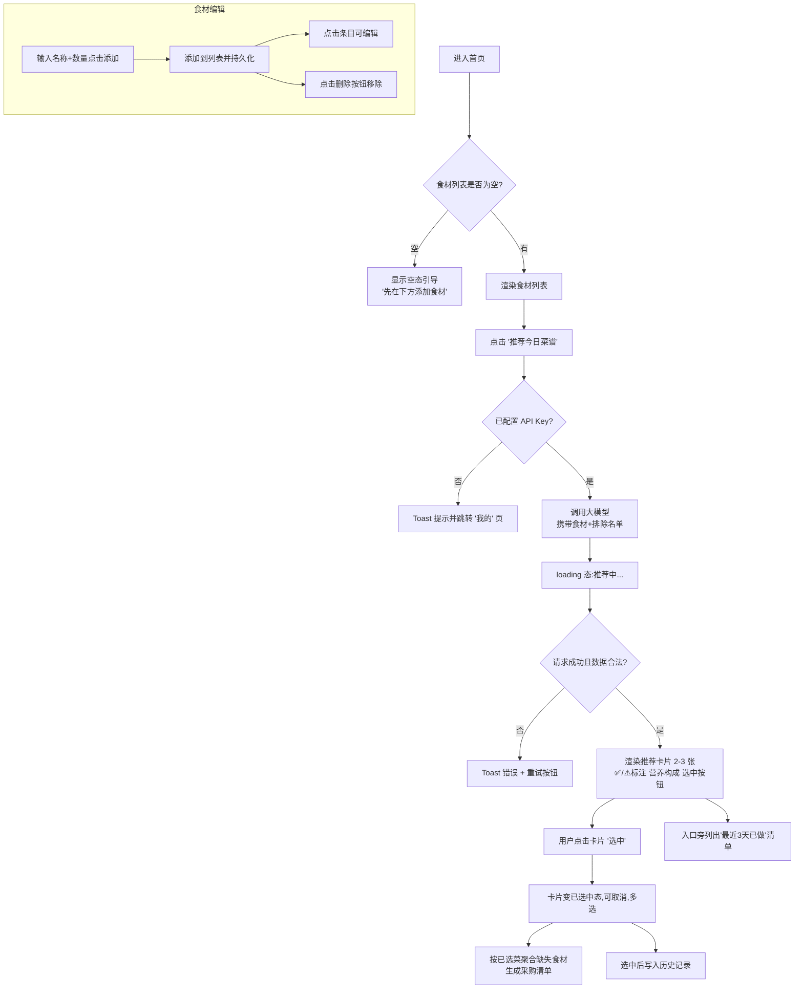
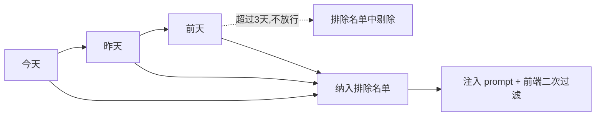

# 产品需求文档 PRD —— 冰箱食材 → 菜谱推荐

## 1. 产品概述

单页 Web 应用（纯静态），供两个人（无登录体系）在各自的手机/设备上使用，用于**录入家中冰箱现有食材** → **借助大模型推荐当天可做的菜** → **自动生成采购清单**，并记录历史避免短期内重复吃同一种菜。

- 部署：Vercel 免费静态托管
- 前端：单页 HTML + 原生 JavaScript + Tailwind CSS（CDN）
- 存储：localStorage（本地独立，无需后端）
- AI：国内大模型（DeepSeek / 通义千问），OpenAI 兼容接口，API Key 用户自填存 localStorage

---

## 2. 目标用户与使用场景

| 维度 | 说明 |
|---|---|
| 用户 | 同一家庭的两个人，各自在自己手机上使用 |
| 场景 | 每天做饭前打开应用，录入/核对冰箱食材，获取今日菜谱与采购清单 |
| 账户 | 无，无登录注册，数据存各自设备 localStorage |

---

## 3. 核心功能（P0）

### 3.1 食材录入与管理
- 手动/添加食材：名称 + 数量（如「鸡蛋 4个」「土豆 2个」）
- 支持编辑已存在的食材（名称、数量均可改）
- 支持删除食材
- 数据持久化：关页重开数据仍在（localStorage）
- 边界：空名称校验、重复名称去重（同名合并数量或提示）、数量允许文字（如「1把」「半颗」）

### 3.2 菜谱推荐
- 基于当前食材列表调用大模型，推荐 **今天可做的 2-3 道菜**
- 每道菜字段：
  - 菜名
  - 所需食材
  - 简要做法（3-5 步）
  - 预估营养构成：蛋白质 / 蔬菜 / 主食 是否齐全（用 **有/无** 判定，如「蛋白质✅ 蔬菜✅ 主食⚠️」）
- 食材标注：
  - 冰箱中已具备 → ✅
  - 冰箱中缺少 → ⚠️（并标出缺少数量/名称）
- 每张推荐卡片带一个 **「选中」按钮**：用户点选确实要做的菜，选中后才写入历史；不选不记录
- 选中态：卡片变「已选中」，可再次取消；可多选（1 张或多张）
- 异常处理：无食材时不可推荐并提示；API Key 未填时跳到设置页；请求失败给出可重试按钮

### 3.3 采购建议
- 从推荐结果中提取「缺少」食材集，合并同类项，输出简洁购物清单
- 采购清单随推荐结果一起展示，可一键复制/保存
- **跟随选中**：按「已选中」的菜聚合缺失食材；尚未选中时展示全部推荐菜的总缺失，选中增多则清单聚焦到真正要做的菜

### 3.4 历史记录与去重
- **手动记录**：用户在推荐卡片上点「选中」的菜，才写入历史（日期 + 菜名 + 使用食材）；未选中的不记录
- 仅排除最近 3 天；3 天前做过的菜会自然回到推荐池（符合「以前做过的能再次推荐」）
- 历史记录页按日期**倒序**展示，可分组查看当日多道菜
- 纯前端校验排除逻辑；大模型 prompt 中同步携带排除名单增强约束

---

## 4. 页面结构（共 3 页 + 底部 Tab 导航）

| Tab | 页面 | 职责 |
|---|---|---|
| 冰箱 | 首页 | 食材录入/编辑/删除 + 菜谱推荐入口 + 推荐结果 + 采购清单 |
| 历史 | 历史记录页 | 按日期倒序查看每日菜谱 |
| 我的 | 设置页 | API Key 录入/保存/清除、模型选择、关于说明 |

说明：推荐结果与采购清单展示在「冰箱」页内，采用卡片区，避免新建页面，保持单页交互流畅。

> 采用单 HTML 实现，3 个「页面」实为 3 个可切换的 `<section>`（display:none 切换 + Tab 高亮联动），无需路由。

---

## 5. 交互流程（文字描述）

### 5.1 首页（冰箱）


### 5.2 「最近 3 天」排除规则

- 判定标准：历史记录中「菜名」出现于 **今天 / 昨天 / 前天**（自然日）→ 加入排除名单。
- 「3 天」按自然日计算，不按 72 小时。
- 排除维度为**菜名**（大小写/空白归一后比对），同日做两道相同菜只计一次。

### 5.3 历史记录页
- 进入即读取 localStorage 并按日期倒序渲染。
- 每组：日期（今天/昨天/前天 显示相对文案，其余显示完整日期）+ 当日菜名列表 + 使用食材小字。
- 支持清空历史（二次确认）。
- 条数极少（<100），无分页，直接全量渲染。

### 5.4 设置页
- 表单：API Key 输入（密码框，可显示/隐藏）+ 模型下拉（deepseek-chat / qwen-plus 等）+ 保存按钮。
- 保存 → 写入 localStorage → Toast 反馈。
- 清除按钮：移除 API Key。
- 提示：Key 仅存本机 localStorage，不上传。
- 可选「AI 接口代理模式」说明：本地直连失败时可配置 Vercel 代理地址（备选，见 plan）。

---

## 6. 大模型提示词模板

采用 **system + user** 双段结构，要求**严格输出纯 JSON**（用 JSON 代码块包裹），便于前端 `JSON.parse` 解析。

### System Prompt
```
你是家庭厨房美食助手。根据用户当前冰箱的食材，推荐今天可以做的菜肴。
规则：
1. 推荐 2~3 道菜，全部使用冰箱里已有的食材为主，可以补充极少量常见调味料（油盐酱醋糖）。
2. 优先推荐能覆盖【蛋白质、蔬菜、主食】三大类的组合；若某类缺失，请如实标注为"缺失"。
3. 所有"所需食材"里，必须逐个标注该食材在冰箱中【已有】还是【缺】。
4. 只输出 JSON，不要输出任何解释或 Markdown 说明文字。

输出格式（严格 JSON）：
{
  "dishes": [
    {
      "name": "菜名",
      "ingredients": [
        {"name":"食材名","status":"已有|缺"}
      ],
      "steps": ["步骤1","步骤2","步骤3"],
      "nutrition": {"protein":"齐全|缺","vegetable":"齐全|缺","staple":"齐全|缺"}
    }
  ]
}
```

### User Prompt
```
【冰箱现有食材】：
- 鸡蛋 4个
- 土豆 2个
- 西红柿 3个

【最近3天内做过的菜，请不要再推荐】：
- 番茄炒蛋

请推荐 2~3 道今天可做的菜，并给出购物清单（缺的食材）。
```

（实际拼接时，现有食材 = 当前列表；排除名单 = 最近 3 天历史菜名。若排除名单为空，则该行改写为「暂无」或删去该行。）

---

## 7. localStorage 数据 Schema

统一 keys：使用 `fridge:` 前缀避免冲突。

```jsonc
// Key: fridge:ingredients   —— 食材列表（P0）
{
  "version": 1,
  "updatedAt": 1690000000000,        // 时间戳，毫秒
  "items": [
    {
      "id": "uuid-1",                 // 唯一 id(自增或随机)
      "name": "鸡蛋",                  // 食材名称
      "amount": "4个",                 // 数量(允许文字)
      "createdAt": 1690000000000
    }
  ]
}

// Key: fridge:history   —— 历史记录（P0，记录的是用户「选中」做过的菜）
// 写入时机：推荐后用户在卡片上点「选中」时逐道写入；未选中不写入。
{
  "version": 1,
  "records": [
    {
      "id": "uuid-2",
      "date": "2026-09-30",          // 自然日 YYYY-MM-DD（本地时区）
      "dishes": [
        {
          "name": "番茄炒蛋",
          "ingredients": [ {"name":"鸡蛋","status":"已有"}, {"name":"西红柿","status":"已有"} ],
          "nutrition": {"protein":"齐全","vegetable":"齐全","staple":"缺"},
          "recipeId": "uuid-3"        // 关联recipeId(可选)
        }
      ]
    }
  ]
}

// Key: fridge:settings   —— 设置（P0：API Key）
{
  "apiKey": "sk-********",           // 大模型 API Key（不硬编码，仅存本地）
  "model": "deepseek-chat",          // 模型标识
  "baseUrl": "https://api.deepseek.com", // OpenAI 兼容接口地址
  "proxyMode": false                 // 备选：是否走 Vercel 代理
}

// Key: fridge:recipes   —— 最近一次推荐结果缓存（可选，便于回看）
{
  "date": "2026-09-30",
  "dishes": [ /* 同 history.dishes 结构 */ ],
  "shoppingList": [ {"name":"生抽","qty":"1瓶"} ]
}
```

设计说明：
- 每个对象带 `version`，日后升级 schema 可做迁移（`migrate()` 兜底）。
- `id` 用 `crypto.randomUUID()`（现代浏览器支持）或时间戳+随机兜底。
- 所有写入统一走 `writeJSON(key, obj)` 封装：`JSON.stringify` + 异常捕获（容量超限时 Toast 提示）。

---

## 8. 非功能需求

- **视觉**：中文界面，主色调绿色（食物新鲜感）或橙色，Tailwind 配色（如 `emerald`/`orange`）。
- **响应式**：移动端优先，适配 375px–430px；桌面端简单居中限宽（max-w-md 左右）。
- **性能**：数据量 <150 条，全量读写 localStorage 即可，无需索引。
- **兼容**：目标现代移动浏览器（iOS Safari / Android Chrome）。
- **隐私/安全**：API Key 仅存 localStorage，请求由浏览器直接发往前端，需注意 CORS（见 plan 备选方案）；不做任何服务端存储。

---

## 9. 范围外（明确不做 / 暂缓）
- 用户登录注册（明确不做的）
- 云端多端同步（需要时用 Supabase，本版不做）
- 食材图片拍照识别
- 营养计算精度（仅「齐全/缺」粗粒度）
- 菜谱收藏/评分
- 桌面 PWA 安装优化（仅移动端需 manifest）

---

## 10. 风险与备选方案

| 风险 | 影响 | 方案 |
|---|---|---|
| 大模型 API 存在 CORS 限制 | 浏览器直连 fetch 失败 | 主用国内厂商(通常允许跨域，如 DeepSeek/通义直连)；若仍失败 → Vercel Edge Function 代理转发（见 plan.md 备选） |
| API Key 由用户在浏览器填写 | 有泄露到请求地址栏风险 | 仅存 localStorage；提示用户使用低配额/可控额度的 Key |
| 大模型返回非 JSON | 前端解析失败 | prompt 强约束 + 解析时提取首个 JSON 代码块 + 失败重试 |
| 重复推荐同一道菜 | 用户感知差 | 排除名单 + 前端二次过滤兜底 |

---

## 11. 验收标准速览（详见 checklist.md）
- 食材刷新不丢、增删改生效
- 推荐标注 ✅/⚠️ 正确
- 最近 3 天排除生效
- 历史按日期倒序
- 移动端底部导航不遮挡
- API Key 不硬编码
- Vercel + 手机可访问